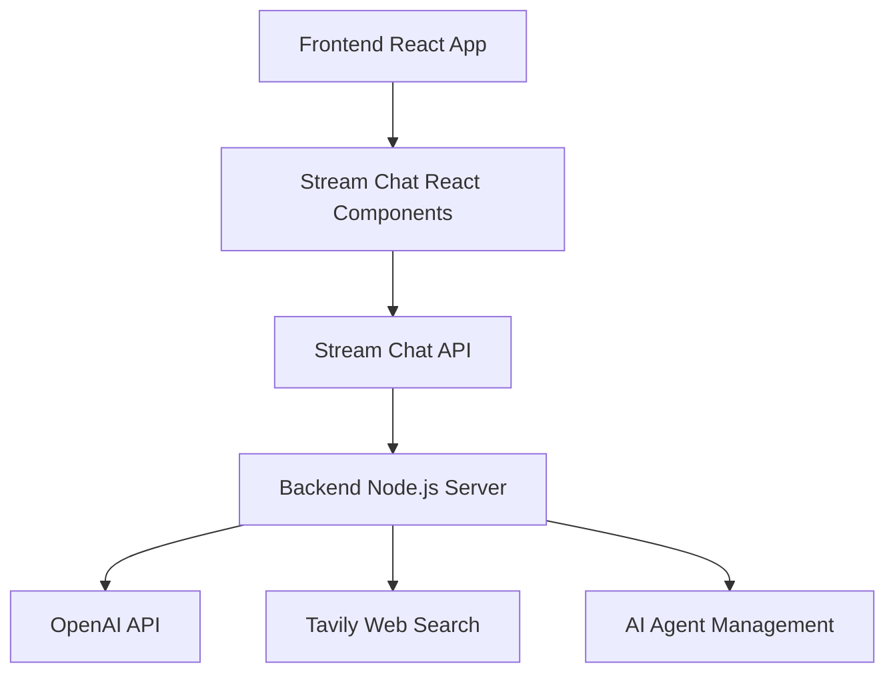

# Chat AI App

A modern AI-powered chat application built with **Stream Chat**, **OpenAI**, and **web search capabilities**. This full-stack application provides an intelligent writing assistant that can help with content creation, research, and real-time collaboration.

## 🚀 Features

- **Real-time Chat**: for seamless messaging
- **AI Writing Assistant**: OpenAI GPT-4 integration for intelligent content generation
- **Web Search**: Live web search capabilities using Tavily API for current information
- **Modern UI**: Beautiful React interface with dark/light theme support
- **Writing Prompts**: Categorized writing prompts for business, content, communication, and creative tasks
- **Agent Management**: Dynamic AI agent lifecycle management
- **Secure Authentication**: JWT-based token authentication
- **Responsive Design**: Mobile-first design with Tailwind CSS

## 🏗️ Architecture

### Backend (`nodejs-ai-assistant/`)

- **Node.js/Express** server
- **Stream Chat** server-side integration
- **OpenAI API** for AI responses
- **Tavily API** for web search functionality
- Agent management system with automatic cleanup

### Frontend (`react-stream-ai-assistant/`)

- **React** with TypeScript
- **Stream Chat React** components
- **Tailwind CSS** + **shadcn/ui** for modern styling
- **Vite** for fast development and building


### Core Concepts

1. **Stream Chat Client**: Handles all chat operations and real-time updates
2. **Channels**: Individual chat rooms where messages are exchanged
3. **Users**: Authenticated participants in the chat
4. **Messages**: Text, files, reactions, and custom data
5. **Tokens**: JWT-based authentication for secure access

### Integration Flow



### Key Features Used

- **Real-time Messaging**: Instant message delivery and updates
- **User Presence**: Online/offline status indicators
- **Channel Management**: Create, join, and manage chat channels
- **Message Threading**: Support for threaded conversations
- **File Uploads**: Share images and documents
- **Custom Fields**: Extended message and user data
- **Webhooks**: Server-side event handling

## 🤖 AI Agent System

The application features a sophisticated AI agent management system:

### Agent Lifecycle

1. **Creation**: AI agents are created per channel when requested
2. **Initialization**: OpenAI assistant setup with web search capabilities
3. **Message Handling**: Processes user messages and generates responses
4. **Web Search**: Automatically searches the web for current information
5. **Cleanup**: Automatic disposal after inactivity

### Agent Capabilities

- **Content Writing**: Various writing tasks from business to creative
- **Web Research**: Live search for current information and facts
- **Context Awareness**: Maintains conversation context
- **Customizable Prompts**: Specialized writing assistance

## 🎨 UI Components

The frontend uses modern UI components built with:

- **Radix UI**: Accessible component primitives
- **Tailwind CSS**: Utility-first CSS framework
- **shadcn/ui**: Beautiful, customizable components
- **Lucide React**: Modern icon library
- **Dark Mode Support**: System preference detection

## 📡 API Endpoints

### Backend Routes

- `GET /` - Health check and server status
- `POST /start-ai-agent` - Initialize AI agent for a channel
- `POST /stop-ai-agent` - Stop and cleanup AI agent
- `GET /agent-status` - Check AI agent status
- `POST /token` - Generate user authentication tokens

## 🔒 Security Features

- **JWT Authentication**: Secure token-based authentication
- **Environment Variables**: Sensitive data protection
- **CORS Configuration**: Cross-origin request security
- **Token Expiration**: Automatic token refresh system
- **Input Validation**: Server-side validation for all requests

```

## 📚 Technologies Used

### Backend

- **Node.js** - Runtime environment
- **Express** - Web framework
- **Stream Chat** - Real-time messaging
- **OpenAI** - AI language model
- **Axios** - HTTP client
- **CORS** - Cross-origin resource sharing
- **TypeScript** - Type safety

### Frontend

- **React** - UI library
- **TypeScript** - Type safety
- **Vite** - Build tool
- **Stream Chat React** - Chat UI components
- **Tailwind CSS** - Styling
- **Radix UI** - Accessible components
- **React Hook Form** - Form handling
- **React Router** - Navigation

## 🤝 Contributing

1. Fork the repository
2. Create a feature branch
3. Make your changes
4. Test thoroughly
5. Submit a pull request


## 🆘 Support

For support and questions:
- Create an issue in this repository

---

Built with ❤️ using GetStream.io, OpenAI, and modern web technologies.
