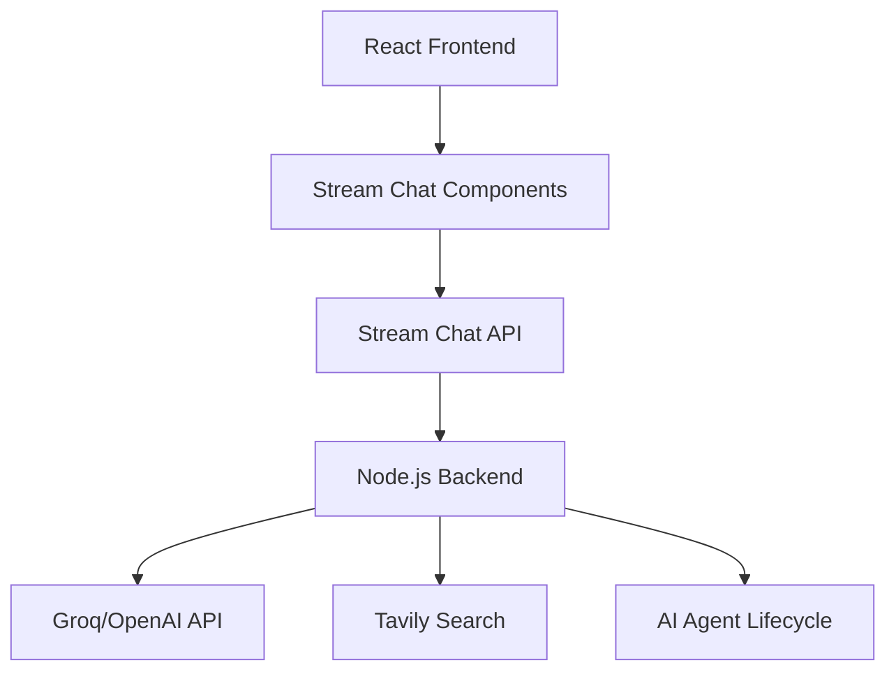

# Quirky AI Chat App 🎭

A modern AI-powered chat application built with **Stream Chat**, **Groq/OpenAI**, and **live web search**.  
This full-stack app acts as a quirky and smart writing assistant to help with content creation, research, and real-time collaboration.

---

## ✨ Features

- **⚡ Real-time Chat** – smooth messaging with instant updates  
- **🤖 AI Writing Assistant** – powered by Groq/OpenAI for fast, intelligent responses  
- **🔍 Web Search** – fetches current information directly in chat  
- **🎨 Modern UI** – sleek React interface with dark & light themes  
- **📝 Writing Prompts** – prebuilt prompts for business, content, communication, and creativity  
- **🧑‍🤝‍🧑 Agent System** – AI agents that can join, leave, and manage conversations dynamically  
- **🔐 Secure Auth** – JWT-based authentication  
- **📱 Responsive** – mobile-first design with Tailwind CSS  

---

## 🏗️ Architecture Overview

### Backend (`nodejs-ai-assistant/`)

- **Node.js/Express** backend  
- **Stream Chat** integration  
- **Groq/OpenAI API** for intelligent responses  
- **Tavily API** for live search  
- Agent lifecycle management with cleanup  

### Frontend (`react-stream-ai-assistant/`)

- **React + TypeScript**  
- **Stream Chat React** components  
- **Tailwind CSS + shadcn/ui** for styling  
- **Vite** for blazing-fast builds  

---

### 🔄 Flow

---

## 🧠 AI Agent System

Agents in **Quirky AI Chat App** can:  
- Write content in multiple styles  
- Search the web for real-time info  
- Keep track of context in conversations  
- Respond with creativity and precision  
- Self-cleanup after inactivity  

---

## 🎨 UI Components

- **Radix UI** – accessible primitives  
- **Tailwind CSS** – modern utility-first styling  
- **shadcn/ui** – customizable UI elements  
- **Lucide React** – icon library  
- **Dark/Light mode** – auto system detection  

---

## 📡 API Endpoints

- `GET /` – health check  
- `POST /start-ai-agent` – spin up an agent for a channel  
- `POST /stop-ai-agent` – stop and clean up  
- `GET /agent-status` – check agent status  
- `POST /token` – issue JWT tokens  

---

## 🛡 Security Highlights

- JWT authentication  
- Environment variable config  
- CORS setup  
- Token expiration & refresh  
- Input validation  

---

## 📚 Tech Stack

**Backend:** Node.js, Express, Stream Chat, Groq/OpenAI, Tavily, TypeScript  
**Frontend:** React, TypeScript, Vite, Tailwind, Radix UI, shadcn/ui, Stream Chat React  

---

## 🤝 Contribution Guide

1. Fork this repo  
2. Create a new branch  
3. Add your feature/fix  
4. Test thoroughly  
5. Submit a PR 🚀  

---

## 🆘 Support

For questions/issues:  
- Open an issue in this repo  

---

Built with 💡 using **GetStream.io, OpenAI, and modern web technologies.**

